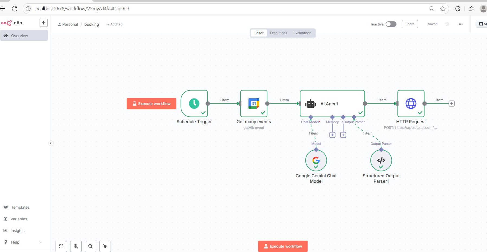

# 📞 AI Voice Call Reminder Agent for Hospitals

An autonomous AI-based voice call system built using `n8n`, Google Calendar, Gemini LLM, and Retell AI that reminds patients of their appointments and handles voice interactions such as rescheduling or connecting to a clinic assistant. This is designed for hospitals and clinics to automate daily appointment reminders through intelligent voice calls.

## 🧠 How It Works

Every day at **9:00 AM**, the automated system:

1. **Schedule Trigger**: Initiates the flow using n8n’s scheduler.
2. **Google Calendar Events**: Fetches all upcoming appointments using the patient’s calendar events.
3. **LLM-Based Agent**: A structured agent powered by Google Gemini parses event data (name, number, email, start time, etc.) into clean JSON.
4. **Retell AI API Call**: The parsed information is sent to Retell’s API, triggering a real-time voice call to the patient.
5. **Voice Agent Functionality**:
   - Informs the patient about the doctor’s schedule and appointment details.
   - Offers options to:
     - ✅ Confirm the appointment.
     - 🔁 Reschedule the appointment.
     - ❓ Ask a query.
     - 👨‍⚕️ Speak directly with a clinic assistant.

## 🖼️ Workflow Diagram

## 📋 Steps Inside Workflow

- **Schedule Trigger**: Configured to run daily at 9:00 AM.
- **Google Calendar Node**: `Get many events` to fetch the patient events.
- **AI Agent Node**: Uses Gemini Chat Model with structured memory and output parser to generate structured details.
- **Structured Output Parser**: Converts LLM output to usable fields like name, number, email, start_time, etc.
- **HTTP Request Node**: Sends data to Retell API endpoint to initiate the voice call.

## 🔮 Future Improvements

- 📱 Add SMS/WhatsApp fallback in case of missed call.
- 🧾 Email summary of calls made to the clinic at end of day.
- 🧠 NLP intent classification from patient response during call.
- 🌐 Add support for multiple languages for diverse patients.
- 🔐 Clinic dashboard for logs, failed calls, and reschedules.
- 📆 Auto-update calendar on successful reschedule via Retell.
- 🧑‍⚕️ EHR integration for full patient visit history linkage.

